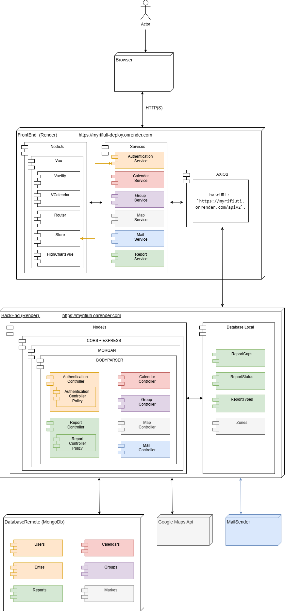

# MyRifiuti
 Simplify your household waste management.

## DEPLOY
* NEW [myrifiuti-deploy.onrender.com](https://myrifiuti-deploy-fvjt.onrender.com)
* OLD [myrifiuti-deploy.onrender.com](https://myrifiuti-deploy.onrender.com)

## STRUCTURE


## ACCOUNTS
### ANONYMOUS USER
```
no credentials
```
### REGISTERED USER
```
e-mail: mariorossi@gmail.com
password: mariorossi
```
To create new account go to First Page -> Register
### ENTE USER
```
username: comune
password: admin
```
To create new account use script in scripts
```
scripts -> createNewEnte.js
```

## 1° SPRINT
* [The Product Backlog](https://docs.google.com/spreadsheets/d/1fSB404_ko7UfG_ONxX8HcZiFO44lBejs-oGBEsbrl7Y/edit?usp=sharing)
* [Sprint Backlog](https://docs.google.com/spreadsheets/d/1sEuMaWGJOMdDcYxXcDykN0flDHW0HYY7jCWyfRluyfw/edit?usp=sharing)

## 2° SPRINT
* [The Product Backlog](https://docs.google.com/spreadsheets/d/1fSB404_ko7UfG_ONxX8HcZiFO44lBejs-oGBEsbrl7Y/edit?usp=sharing)
* [Sprint Backlog](https://docs.google.com/spreadsheets/d/1sEuMaWGJOMdDcYxXcDykN0flDHW0HYY7jCWyfRluyfw/edit?usp=sharing)
  
## Local Start

### Run Client
Navigate to client folder and:
```
npm install
```
Replace files:
* style.css
in
```
client -> node_modules -> v-calendar -> dist -> style.css
```
* VGrid.css
in
```
client -> node_modules -> vuetify -> lib -> components -> VGrid -> VGrid.css
```
Change BackEnd link is local
```
client -> src -> services -> Api.js
```
```
    baseURL: `http://localhost:8081/apiv2`, <--- uncomment this
    //baseURL: `https://myrifiuti.onrender.com/apiv2`,
    //baseURL: `https://myrifiuti-t8yo.onrender.com/apiv2`, <--- comment this
```
npm run dev
```
To build deploy
```
npm run build
```
### Run Server
Navigate to server folder and:
```
npm install
```
```
npm start
```

## MANAGE CALENDAR
In order to set the calendar for each zone use:
```
scripts -> populateCalendar.js
```
